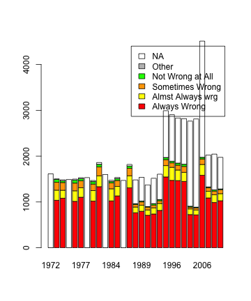
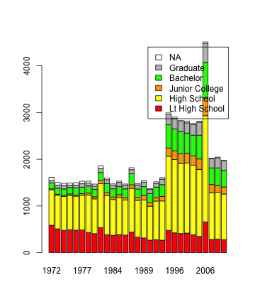

<!-- Make sure that the knitr package is installed and loaded. -->
<!-- For more info on the package options see http://yihui.name/knitr/options -->

<!-- Replace below with the title of your project -->
### TITLE

<!-- Enter the code required to load your data in the space below. The data will be loaded but the line of code won't show up in your write up (echo=FALSE) in order to save space-->


<!-- In the remainder of the document, add R code chunks as needed -->

### Introduction:

This is an Data Analysis project for the Data Analysis and Statistical Inference course of Coursera. 
My main goal with this work, is trying to provide some kinds of evidence that __there is a relationship between the degree of education and the opinion about having sex with other person than spouse.__

I believe that studying the relationship between the degree of education and some behavioral or social aspects can be help to realize an approximation or distancing of some individual values, for example, in case of this study, betrayal. 

This work can be important for sociologists or psychologist, that want to have a better understanding of the human behavior associated with the education degree.


### Data:
The study is based on the General Social Survey dataset, _Smith, Tom W., Michael Hout, and Peter V. Marsden. General Social Survey, 1972-2012 [Cumulative File]_ . This is a sociological survey used to collect data on demographic characteristics and attitudes of residents of the United States.

The dataset can be found online at: http://bit.ly/dasi_gss_data.
The dataset cookbook can be found here: https://d396qusza40orc.cloudfront.net/statistics%2Fproject%2Fgss1.html#educ

The data was collected via survey from 1972 until 2012. Until 1993, GSS was administered almost annually. The target sample size for the annual surveys was 1500; actual sample sizes ranged between 1372 (1990) and 1613 (1972). There were no GSSs in 1979,1981 and 1992.
Since 1994, the GSS has been administered to two samples in event-numbered years, each with a target sample size of 1500, than to a single 1500 person sample each year.
Some questions in the survey, are no applicable to some respondents. For example, the question on martial happiness is only asked of currently married respondents.

For this study, each case represents the respondent of the survey.
The variables analyzed by this study are:

* DEGREE - a categorical variable that represent the respondent's highest degree of education 
* XMARSEX -  a categorical variable that represent the opinion of respondents about having sexual relations with someone than the marriage partner.

This is an observational study, because the data was collected by a survey and there is no interference in that data.
The population of interests is a person resident in United States. 
Based on in the idea that Generalization is based on in the combination of two things: Random Sample and Random Assignment, the study can be generalized to the population of USA, but it's not Causal.
There are some interesting source of bias in the study. First, the respondents can not answer a question, it means there is a Non-Response source of bias. Beside that, there is a kind of Convenience Sample, because the survey is mainly focused on Household, this type of responder are more accessible than others, for example, a person that needs go to the work every day.

There is no causality in these variables, because there is no Random Assignment associated with the study.


### Exploratory data analysis:

The objective of this study is trying to understand the relationship of two categorical variables: DEGREE and XMARSEX.
Before start a study more deeper about this relationship, we will take a look on each column data separately.

Let's investigate the data in XMARSEX column:


```r
table(gss$xmarsex, useNA = "ifany")
```

```
## 
##     Always Wrong Almst Always Wrg  Sometimes Wrong Not Wrong At All 
##            25929             4581             2652              857 
##            Other             <NA> 
##                0            23042
```


At the first impression, seems that the majority of the population thinks that the "having sexual relation with someone than you marriage partner" is Always Wrong. Just a little part of this population think that is Not Wrong at All.
The XMARSEX is categorical variable. To explore how representative are the answers for each option, we will build a frequency table for her.

Take a look at the frequency table: 


```r
table(gss$xmarsex, useNA = "ifany")/dim(gss)[1]
```

```
## 
##     Always Wrong Almst Always Wrg  Sometimes Wrong Not Wrong At All 
##          0.45441          0.08028          0.04648          0.01502 
##            Other             <NA> 
##          0.00000          0.40381
```


As we said before, about 45% of the population, believes that is Always Wrong having sexual relation with someone different of his spouse and just 1.5% believes that is not Wrong at all.
It's important to note that this variable have a significant number of NA's responses, about 40%, that can be justified by the fact that GSS survey was not executed in some years.
To verifiy that the NAs answers is related with the years that GSS survey was not executed, we can group the responses by years:


```r
table(gss$xmarsex, gss$year, useNA = "ifany")
```

```
##                   
##                    1972 1973 1974 1975 1976 1977 1978 1980 1982 1983 1984
##   Always Wrong        0 1037 1082    0 1013 1103    0 1018 1333    0 1023
##   Almst Always Wrg    0  220  173    0  230  206    0  230  237    0  264
##   Sometimes Wrong     0  173  169    0  169  153    0  143  194    0  129
##   Not Wrong At All    0   61   36    0   63   48    0   53   57    0   33
##   Other               0    0    0    0    0    0    0    0    0    0    0
##   <NA>             1613   13   24 1490   24   20 1532   24   39 1599   24
##                   
##                    1985 1986 1987 1988 1989 1990 1991 1993 1994 1996 1998
##   Always Wrong     1132    0 1308  764  797  709  738  815 1546 1471 1466
##   Almst Always Wrg  207    0  263  125  131  115  132  152  248  285  231
##   Sometimes Wrong   130    0  165   54   74   63   63   60  130   98  107
##   Not Wrong At All   43    0   48   20   17   13   31   26   46   35   44
##   Other               0    0    0    0    0    0    0    0    0    0    0
##   <NA>               22 1470   35  518  518  472  553  553 1022 1015  984
##                   
##                    2000 2002 2004 2006 2008 2010 2012
##   Always Wrong     1448  725  717 1582 1088  988 1026
##   Almst Always Wrg  198  124  107  236  144  168  155
##   Sometimes Wrong   130   39   44  121   76   81   87
##   Not Wrong At All   47   19   19   36   20   26   16
##   Other               0    0    0    0    0    0    0
##   <NA>              994 1858 1925 2535  695  781  690
```

There were no GSSs in 1979,1981 and 1992. As we can see in the table, in these years we don't have information about the NAs, because the data were not inserted in this dataset. In this case, the higher number of NAs is not related with the years that GSS was not executed.
A important information is that some questions may not exist in all years. This is due to the fact that a question may not have been taken in that year. For example in 1972, 1978, 1983 and 1986 the NAs answer is higher, probably this question was not taken in these years. This is an important factor for higher number of NA answers.

Now, lets do the same analysis to DEGREE variable.

First, here a simple table of DEGREE variable data:


```r
table(gss$degree, useNA = "ifany")
```

```
## 
## Lt High School    High School Junior College       Bachelor       Graduate 
##          11822          29287           3070           8002           3870 
##           <NA> 
##           1010
```


At the first impression, we can note that the majority of the population degree of education is concentrated between Lt High School and High School Junior.
Another important thing to note is the number of NAs responses, 1010. This number is much smaller than the XMARSEX, but it's still loud.


Take a look at the frequency table for DEGREE variable.


```r
table(gss$degree, useNA = "ifany")/dim(gss)[1]
```

```
## 
## Lt High School    High School Junior College       Bachelor       Graduate 
##        0.20718        0.51326        0.05380        0.14024        0.06782 
##           <NA> 
##        0.01770
```

Looking the data, we can see that the NA values represents about 1.7% of the total. Is much smaller than the 40% of the NAs in the XMARSEX variable.
Now lets to analyze the DEGREE answers by year:


```r
table(gss$degree, gss$year, useNA = "ifany")
```

```
##                 
##                  1972 1973 1974 1975 1976 1977 1978 1980 1982 1983 1984
##   Lt High School  587  510  479  492  482  488  431  407  539  385  374
##   High School     762  720  722  732  728  741  804  745  938  835  764
##   Junior College   17   20   25   33   24   34   42   45   74   61   54
##   Bachelor        124  132  139  140  152  139  151  158  165  202  175
##   Graduate         52   65   73   50   61   74   62   71   84   80   77
##   <NA>             71   57   46   43   52   54   42   42   60   36   29
##                 
##                  1985 1986 1987 1988 1989 1990 1991 1993 1994 1996 1998
##   Lt High School  387  376  441  335  315  268  280  267  478  425  409
##   High School     795  750  934  785  814  726  825  840 1586 1567 1500
##   Junior College   60   48   77   65   96   75   73   97  176  187  209
##   Bachelor        175  192  238  179  189  197  224  253  497  471  478
##   Graduate         90   80   87   89   95   87   81  118  216  224  205
##   <NA>             27   24   42   28   28   19   34   31   39   30   31
##                 
##                  2000 2002 2004 2006 2008 2010 2012
##   Lt High School  419  386  347  659  283  293  280
##   High School    1501 1485 1435 2273 1003 1001  976
##   Junior College  206  202  224  377  173  145  151
##   Bachelor        435  443  507  763  355  375  354
##   Graduate        218  230  281  403  194  218  205
##   <NA>             38   19   18   35   15   12    8
```


It seems that the DEGREE variable was answered in all years. It can explain why the NAs values are much smaller then in XMARSEX.

Now lets take a look in the relationship of the these two variables:


```r
table(gss$degree, gss$xmarsex)
```

```
##                 
##                  Always Wrong Almst Always Wrg Sometimes Wrong
##   Lt High School         5888              592             498
##   High School           13588             2224            1281
##   Junior College         1362              242             117
##   Bachelor               3191              920             427
##   Graduate               1369              563             289
##                 
##                  Not Wrong At All Other
##   Lt High School              208     0
##   High School                 398     0
##   Junior College               52     0
##   Bachelor                    103     0
##   Graduate                     85     0
```


It seems that the majority of the population, independent of the degree,  think that is Always Wrong having sexual relations with someone different than your marriage partner.

Here, some visualizations to facilitate the understanding of the data:

The distribution of XMARSEX answers by year:


```r
barplot(table(gss$xmarsex, gss$year, useNA = "ifany"), col = c("red", "yellow", 
    "orange", "green", "grey", "white"), legend = c("Always Wrong", "Almst Always wrg", 
    "Sometimes Wrong", "Not Wrong at All", "Other", "NA"))
```

 


Some visualizations of DEGREE Variable:


```r
plot(gss$degree)
```

 


```r
barplot(table(gss$degree, gss$year, useNA = "ifany"), col = c("red", "yellow", 
    "orange", "green", "grey", "white"), legend = c("Lt High School", "High School", 
    "Junior College", "Bachelor", "Graduate", "NA"))
```

 


About the relationship between the two variables: 


```r
mosaicplot(table(gss$degree, gss$xmarsex), las = 1)
```

 


In the mosaic plot visualization, you can see that the distribution for the Always Wrong option is decreasing as the level of education increases. Despite having fewer responses, the Not Wrong At All option has greater number of responses to the highest degree of education.


### Inference:

Insert inference section here...

### Conclusion:

Insert conclusion here...

